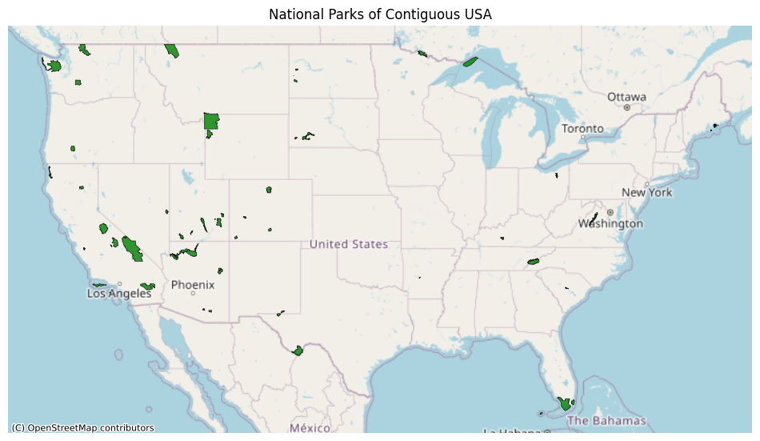

# Extract Transform Pipeline

### Overview

The Extract Transform Pipeline is designed to process and normalise biodiversity data from the U.S. National Parks Service, providing a structured and consistent dataset for further analysis or loading into a PostgreSQL database. This pipeline extracts raw data, applies category-specific transformations, and ensures data integrity through a series of robust validation and normalisation processes

### Directory Structure
```markdown
ExtractTransform/
│
├── config/
│
├── testing/
│   ├── Data/
│   ├── test_parks_consistency.py
│   └── test_record_consistency.py
│
├── transform_strategies/
│   ├── __init__.py
│   ├── abstract_strategy.py
│   ├── bird_transform.py
│   ├── mammal_transform.py
│   └── strategy_factory.py
│
├── utils/
│   ├── __init__.py
│   ├── dataframe_transformation.py
│   └── dataframe_utils.py
│
├── __init__.py
├── extract_species.py
├── extract_transform_parks.py
├── transform_records.py
├── transform_species.py
│
└── README.md
```

### Pipeline Deliverables

The Extract Transform pipeline produces several key deliverables, each aimed at ensuring data integrity, traceability, and ease of review:

Pandas DataFrames
- DataFrames are staged within [`pipeline.py`](pipeline.py) ready to populate a PostgreSQL database (the load stage)

Pickle Files:
- The dataframes are saved as pickle files, categorised by species (e.g., Bird, Mammal, Reptile, ...) ensuring future loading tasks use high fidelity data.

Backup CSV Files: 
- A directory of CSV files is created whenever a potentially destructive action takes place (e.g., data filtering, removal of erroneous or ambiguous records).
- These backups ensure that original data or intermediary results are preserved for further inspection or recovery if needed.

Logs:
   - Log files are generated for each transformation process. These logs capture critical steps, including data loading, cleaning, transformation actions, and any errors encountered.
   - Logs are organised by transformation type and timestamp, facilitating easy tracking of the pipeline’s operations.

YAML Files for Manual Review:
   - The pipeline generates YAML files formatting Python dictionaries into a human-readable format.
   - These contain data flagged for manual review, such as records with ambiguous names or those requiring specific user decisions making the review process straightforward and organised.

----

## Species Data

### [`extract_species.py`](ExtractTransform/utils/extract_species.py)

Extracts a [public domain dataset](https://www.kaggle.com/datasets/nationalparkservice/park-biodiversity?select=species.csv) provided by the U.S. National Parks Service using the GitHub API. This data is stored in the DATA directory at this repositories root


The `ExtractSpecies` class orchestrates the extraction, cleaning, and transformation of the species data into a structured Pandas DataFrame, which is then serialised as a pickle file for downstream processes. Key transformations include:

**Categorical Column Instantiation**:
- Specific categorical fields such as `conservation_status`, `abundance`, `nativeness`, `record_status`, and `occurrence` are converted to categorical data types with explicitly enumerated orders. 
- This approach ensures that the values are constrained within expected domains and ordered logically, facilitating efficient filtering and sorting operations.

**Handling Missing Values**: 
- The transformation process includes the systematic filling of NaN values across critical columns using predefined default values. 
- For instance, fields like `conservation_status`, `abundance`, `nativeness`, and `occurrence` are populated with contextually appropriate defaults to ensure completeness and readiness for analytical tasks.

**Data Cleaning and Validation**: 
- The class implements a robust cleaning routine that removes non-standard characters, corrects misaligned data, and filters out records with unapproved statuses. 
- Logs and backup CSVs are generated at each stage to document and preserve intermediate states, enhancing traceability and error recovery.

---

### [`transform_species.py`](ExtractTransform/utils/transform_species.py)

Subsets the data by `category` and aims to normalise species records whereby each unique `scientific_name` has an associated unique `common_name` using regular expressions, counter objects and pattern matching. The process is automated but requires user input when scaling to new categories. 

The `TransformSpecies` class transforms species data by specified categories like 'Mammal', 'Bird', etc. An instance of this class can be instantiated with either a pickle file or a pandas DataFrame. 
```python
species_data = ExtractSpecies()
species_df = species_data.dataframe
category = 'Bird'

# Instantiate using a DataFrame
birds = TransformSpecies(category, dataframe=species_df)
bird_df = birds.dataframe

# Instantiate using a pickle file
birds = TransformSpecies(category, pickle_path='FinalData/species_master.pkl')
bird_df = birds.dataframe
```
The precise data structure of the `extract_species` stage is then verified.

### [`transform_strategies/`](ExtractTransform/transform_strategies/)

- This module implements a strategy pattern for transforming species data by category. The module includes an abstract base class and concrete strategy implementations for specific categories like Birds and Mammals. These strategies are designed to handle category-specific data transformations, ensuring that each species is correctly identified and categorised based on domain-specific rules.

#### [`abstract_strategy.py`](ExtractTransform/transform_strategies/abstract_strategy.py)

Defines the `TransformStrategy` abstract base class, which serves as a blueprint for all category-specific transformation strategies. It outlines two essential methods:

- `apply_transformations()`: Applies the necessary transformations to the DataFrame for the specific category.
- `create_category_columns()`: Adds category-specific columns to the DataFrame, enhancing data with relevant domain-specific attributes.

#### [`strategy_factory.py`](ExtractTransform/transform_strategies/strategy_factory.py)

- The `TransformStrategyFactory` class provides a mechanism to dynamically select and instantiate the appropriate transformation strategy based on the species category. This approach allows for scalable extension as new categories are added, simply by defining new strategy classes and registering them with the factory.

#### [`bird_transform.py`](ExtractTransform/transform_strategies/bird_transform.py)

Implements the `BirdTransformStrategy` class, tailored for the Bird category. Key functionalities include:

- **Identifying Raptors/Birds of Prey**: Uses predefined lists of common names and scientific families associated with raptors to identify and flag birds of prey. This allows the dataset to be enriched with the specific attributes; `raptor_group` and boolean `is_raptor`, facilitating targeted analysis of these species.

#### [`mammal_transform.py`](ExtractTransform/transform_strategies/mammal_transform.py)

Implements the `MammalTransformStrategy` class, designed for the Mammal category. Key functionalities include:

- **Identifying Large Predators**: Utilises predefined lists of common names and scientific families to identify large land-based predators like big cats, bears, and wolves. The strategy distinguishes these predators while excluding non-relevant or domesticated species, adding `large_predator` and `is_large_predator` attributes for easy identification and analysis.


#### Benefits of Using Strategy Patterns in Transformations

- **Modular and Extensible Design**: By encapsulating category-specific logic within individual strategy classes, the design remains modular, making it straightforward to add new categories or modify existing ones without impacting other parts of the pipeline.
  
- **Category-Specific Enrichment**: Each strategy is tailored to enhance the dataset with attributes that are most relevant to its category. For example, raptors are flagged in birds, while large predators are identified among mammals, enabling more nuanced and targeted data analysis.

This strategic approach not only enhances the dataset with domain-specific knowledge but also ensures that the data pipeline remains scalable, maintainable, and adaptable to evolving requirements.

---

### [`transform_records.py`](ExtractTransform/utils/transform_records.py)

Manages the transformation, normalisation, and consolidation of species records across different categories to ensure data consistency and integrity.


The `TransformRecords` class is responsible for orchestrating the transformation and normalisation processes across multiple DataFrames of species records, ensuring that each category of species (e.g., Birds, Mammals) is processed uniformly and assigned a unique species code. The class undertakes several key operations:

- **Data Assignment and Finalisation**: The class reads in a list of DataFrames and assigns them to specific attributes based on the `category` field, such as `bird`, `mammal`, or `reptile`. It then consolidates these DataFrames into a unified records DataFrame, applying necessary adjustments to align their structures.

- **Species Code Assignment**: For each category, the class assigns unique species codes based on sorting criteria, ensuring that each species is distinctly identified. This step is crucial for maintaining the uniqueness of species records and facilitating efficient lookups and joins in downstream processes.

- **Data Dictionary Generation**: The class generates a comprehensive data dictionary for both the consolidated records and individual species DataFrames. This dictionary includes column names, data types, and unique values for key categorical fields, providing a detailed schema overview that supports data validation and analysis.

- **Random Index Selection**: For testing and validation purposes, the class can randomly select a specified number of indices from the records DataFrame, logging the selected records to facilitate manual inspection and verification.


By assigning unique species codes and verifying data integrity, the class helps maintain a high standard of data quality, enabling accurate and reliable analyses in downstream processes. Its systematic approach to handling discrepancies and consolidating records ensures that the final dataset is both comprehensive and robust.

----

## National Parks Data

### [`extract_transform_parks.py`](ExtractTransform/extract_transform_parks.py)

**Deliverables:** 
- [parks_points.geojson](https://github.com/pineapple-bois/USNationalParks/blob/main/ExtractTransform/FinalData/parks_points.geojson)
- [parks_shapes.geojson](https://github.com/pineapple-bois/USNationalParks/blob/main/ExtractTransform/FinalData/parks_shapes.geojson)

**Data Sources:** 
- Geospatial data was sourced from [Data.gov](https://catalog.data.gov/dataset/national-park-boundaries/resource/cee04cfe-f439-4a65-91c0-ca2199fa5f93), an official site of the US government.
- National Park data was sourced from a [Kaggle dataset](https://www.kaggle.com/datasets/nationalparkservice/park-biodiversity?select=parks.csv).

**Data Transformation:**
- Normalised National Park codes using regex and fuzzy pattern matching to handle discrepancies between datasets.
- Created two GeoJSON files with POINT and POLYGON geometries to represent park locations and boundaries.
- Fields include: `park_code`, `park_name`, `state`, `square_km`, and `geometry`.

Spatial data is plotted below on a basemap to visualise park locations and boundaries.



### Functional Approach Rationale

The `extract_transform_parks.py` script employs a functional approach because it performs a specific, one-time transformation task: extracting, cleaning, and formatting geospatial data for national parks. Given that park shapes and names are stable and unlikely to change, this approach avoids unnecessary complexity.

Key points:
- **Single Responsibility**: Each function performs a distinct task without side effects, ensuring a clear and predictable flow.
- **Efficiency**: Functions execute once and do not need to manage state or handle repeated operations, aligning perfectly with the one-time nature of this data transformation.
- **Simplicity**: The functional approach keeps the code straightforward and easy to maintain, without the overhead of class-based architecture where it isn’t needed.

This approach ensures a simple, efficient, and reliable transformation of static geospatial data for national parks.

----

## Unit Testing

Unit tests are essential for verifying the consistency of newly introduced primary keys, `park_code` and `species_code`, across different datasets. These tests ensure that the keys are uniformly applied, enabling reliable merges and lookups.

#### [`test_parks_consistency.py`](testing/test_parks_consistency.py)

This test suite verifies the consistency of `park_code` across `record_master.pkl`, `parks_points.geojson`, and `parks_shapes.geojson`.

Key features include:
- **Consistency Checks**: Extracts and compares `park_code` values from each dataset to ensure alignment.
- **Mismatch Detection**: Identifies and logs missing or extra codes, providing details for troubleshooting.
- **Data Integrity**: Confirms that `park_code` values are consistent across all files, maintaining the integrity of geospatial associations with species records.

#### [`test_record_consistency.py`](testing/test_record_consistency.py)

This test suite checks the integrity of `species_code` across `record_master.pkl`, `bird_master.pkl`, and `mammal_master.pkl`. It ensures that each `species_code` is accurately matched with its corresponding data from bird and mammal datasets.

Key features include:
- **Reconstruction Validation**: Verifies that specific records can be accurately reconstructed from the merged data, using expected values for key fields like `order`, `family`, `scientific_name`, and `common_names`.
- **Detailed Assertions**: Provides clear output for any discrepancies found, facilitating quick identification and resolution of data mismatches.
- **Random Indices Utilisation**: Uses random indices generated by the `TransformRecords` class to select samples, ensuring a thorough validation approach.

These unit tests aim to:
- Validate the primary keys, `park_code` and `species_code`, ensuring their consistency across datasets.
- Detect and log any inconsistencies, which could cause downstream errors or compromise data integrity.
- Provide a framework for ongoing testing and validation to maintain the accuracy and reliability of the data pipeline.

----