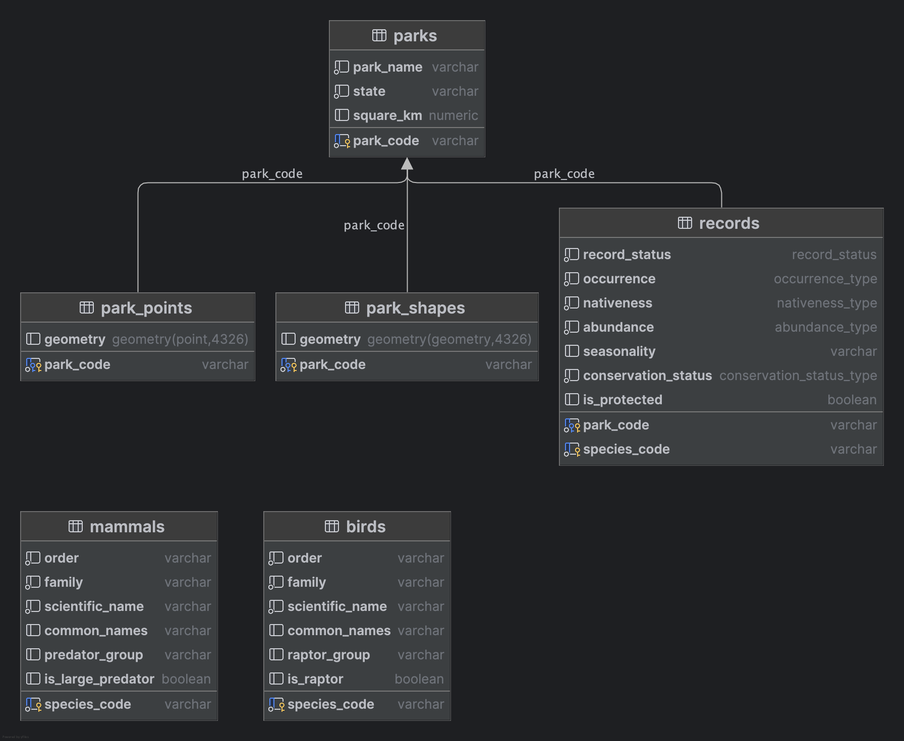

# Biodiversity in US National Parks: An ETL Pipeline

---

### Overview

This project aims to build a partially normalized OLAP (Online Analytical Processing) database to support complex analytical queries on U.S. National Parks, focusing on their biodiversity. The ETL pipeline processes raw biodiversity data from U.S. National Parks into a structured format for analysis in a PostgreSQL database. 

The pipeline includes:

- **Data Extraction**: Raw data is collected from public sources.
- **Data Transformation**: The data is cleaned and standardised, fixing missing values and normalising species names.
- **Data Loading**: Loads the transformed data into a PostgreSQL database designed for complex analysis.

### Features

- **Data Quality**: The pipeline fixes duplicates, inconsistencies, and missing values to ensure reliable data.
- **Geospatial Analysis**: Integrates geospatial data to explore species distributions within park boundaries.
- **Modular Design**: Takes an OOP approach making it easy to add new species categories to the database.
- **Error Handling and Logging**: Tracks every step with detailed logs and handles errors efficiently.
- **Consistency Checks**: Runs tests to ensure primary keys (`park_code` and `species_code`) have a unique constraint.

---

### [Extract Transform Module](ExtractTransform)

Data was sourced from an open source [Kaggle Dataset](https://www.kaggle.com/datasets/nationalparkservice/park-biodiversity?select=species.csv) provided by the US National Parks service.

The main transformation process subsets the data by category, (`Bird`, `Mammal`, `Reptile`, ...) and normalises the taxonomic records. As the records represent National Parks across the USA, often the `scientific_name` (representing *Genus species*) had many; associated common names, typographical errors, and ambiguities. This project necessitates the creation of a master table of taxonomic information; `order, family, scientific_name, common_name` in order to assign a unique reference number to each species and thus abstract it from the records.

As a simple example, we consider the bird of prey species; *Accipiter gentilis* which had the following associated common names:

| scientific_name    | common_names                               |
|--------------------|--------------------------------------------|
| Accipiter gentilis | Eastern Goshawk, Goshawk, Northern Goshawk |
| Accipiter gentilis | Northern Goshawk                           |
| Accipiter gentilis | Goshawk                                    |

As this developer lacks domain expertise in taxonomic nomenclature, decisions on the 'right name' to select were driven by the dataset itself utilising; regular expressions, `collections.Counter` objects, and cross-referencing to find typos.

The above example illuminates the issue of data provenance. The [Northern Goshawk](https://en.wikipedia.org/wiki/Northern_goshawk) was designated as a separate species *Astur atricapillus*, the "American Goshawk" in 2023. A master table of taxonomic information makes it easy to update the database if and when new science on species formerly considered conspecific comes to light. 

#### Object Orientated approach


---


---

### Very Quick Start Guide

This guide will help you explore the SQLite version of the database `national_parks_lite.db` using [SQLAlchemy](https://www.sqlalchemy.org) and Pandas. It was created from [SQL/sqlite_db.py](SQL/sqlite_db.py) 

#### Prerequisites

You can install the necessary packages using:

```bash
pip install sqlalchemy pandas
```

1.	Create a connection to the SQLite database using SQLAlchemy:

```python
from sqlalchemy import create_engine, inspect
import pandas as pd

# Create DB engine
engine = create_engine('sqlite:///national_parks_lite.db')
print(f"Engine type: {type(engine)}")
```

2. Use SQLAlchemy’s inspect function to list all the tables and explore their columns:

```python
# Use the inspect function to get table names
inspector = inspect(engine)
tables = inspector.get_table_names()
print(f"Tables:\n{tables}")

# Explore columns in each table
for table in tables:
    columns = inspector.get_columns(table)
    print(f"\nTable: {table}")
    for column in columns:
        print(f"  {column['name']} - {column['type']}")
```

3.	Run a Sample Query:
- SQL queries are formatted as multi-line strings in Python
```python
# list the top 10 National parks by bird of prey species
sql_query = '''
SELECT
    p.park_name,
    p.state,
    COUNT(*) AS raptor_count
FROM records AS r
LEFT JOIN birds AS b ON r.species_code = b.species_code
LEFT JOIN parks AS p ON r.park_code = p.park_code
WHERE b.is_raptor = True
GROUP BY p.park_name, p.state
ORDER BY raptor_count DESC
LIMIT 10;
'''
```

```python
# Identify National Parks with a population of 'California Condor'
sql_query2 = '''
SELECT
    r.park_code AS park_code,
    p.park_name,
    p.state,
    b.scientific_name,
    b.common_names,
    r.occurrence,
    r.nativeness,
    r.abundance,
    r.seasonality,
    r.conservation_status
FROM records AS r
LEFT JOIN birds AS b ON r.species_code = b.species_code
LEFT JOIN parks AS p ON r.park_code = p.park_code
WHERE b.common_names = 'California Condor'
ORDER BY r.occurrence DESC, r.abundance DESC;
'''
```

4.	Load the query results into Pandas DataFrames facilitating Exploratory Data Analysis within a Jupyter Notebook
```python
df = pd.read_sql_query(sql_query, engine)
df2 = pd.read_sql_query(sql_query2, engine)
```

---

### PostgreSQL Database Design

The PostgreSQL database [schema](schema.sql) is designed to manage U.S. National Parks data efficiently. It includes custom ENUM types, primary keys, a composite primary key, and foreign keys to maintain data integrity and support complex analytical queries.

#### Spatial Data Integration

The schema integrates geospatial data using [PostGIS](https://postgis.net), with `park_points` and `park_shapes` tables storing park locations as points and boundaries as polygons. 

#### Entity Relationship Diagram




#### Primary Keys

- Each table is uniquely identified by a primary key:
  - `parks` table: `park_code`
  - `park_points` and `park_shapes` tables: `park_code`, aligning spatial data with corresponding parks.
  - `birds` and `mammals` tables: `species_code`, ensuring unique identification of species.

- **Composite Primary Key**:
  - The `records` table uses a composite primary key (`park_code`, `species_code`), supporting a many-to-many relationship between parks and species.

#### Foreign Keys

- Foreign keys enforce relationships between tables:
  - `records` table: References `park_code` from the `parks` table, with `ON DELETE CASCADE` to remove related records when a park is deleted.
  - `park_points` and `park_shapes` tables: Also reference `park_code` from the `parks` table.

   
#### Custom ENUM types 

These standardise and constrain values for categorical fields in the `records` table, improving data quality and query efficiency:

- **`record_status`**: `'In Review'`, `'Approved'`
- **`occurrence_type`**: Values range from `'Not Present (False Report)'` to `'Present'`
- **`nativeness_type`**: `'Native'`, `'Not Native'`, `'Unknown'`
- **`abundance_type`**: Includes `'Rare'`, `'Common'`, `'Abundant'`, among others
- **`conservation_status_type`**: From `'Least Concern'` to `'Endangered'` as per the [International Union for the Conservation of Nature](https://www.iucnredlist.org)

----

### Getting Started

To set up and run the pipeline:

1. **Clone the Repository**:
    ```bash
    git clone https://github.com/your-repo-url
    ```

2. **Install Required Packages**:
    - Use the provided `requirements.txt` file to install necessary Python packages:
    ```bash
    pip install -r requirements.txt
    ```

3. **Run the ETL Pipeline**:
    - Execute the main script to run the extract, transform, and load processes:
    ```bash
    python pipeline.py
    ```

4. **Access the Database**:
    - Once the data is loaded, connect to the PostgreSQL database to explore and analyze the data using SQL queries.

---

### Future Enhancements

- **Extend to Additional Species**: Expand the pipeline to include other species categories such as reptiles and amphibians.
- **Enhanced Spatial Analysis**: Integrate more sophisticated spatial analysis tools and visualizations.


